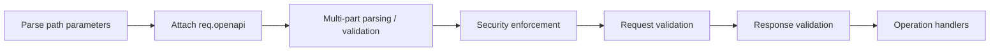

# Contributing

Contributors are welcome!

See something that needs fixing? Got an idea for a new feature? Contribute a [Pull Request](#Create-a-Pull-Request)!

## Easy path to contribution
Click the Gitpod badge to setup a ready to code dev env in the cloud.

[](https://gitpod.io/#https://github.com/cdimascio/express-openapi-validator)

## Standard path to contribution

### Prerequisites / Setup

1. Fork the repo

   ```shell
   # The clone your copy
   git clone <forked-repo>
   ```

2. Install the dependencies

   ```shell
   #
   # Note was only able to develop effectively in this repo using:
   #  - npm v6.x, as its still on package lock version 1
   #  - node 14.x, ran into issues when trying to develop on node 16/18
   #
   # From the project directory, run
   npm i
   ```

Be [Create a Pull Request](#create-a-pull-request) once you've written you code.

## Run the tests

3. Run the tests

   ```shell
   npm test
   ```

## Develop

- Write code
- Add tests to validate new behaviors
- Ensure all tests succeed
- Create a PR
- Have fun!

## Create a Pull Request

1. Fork it
2. Clone it to your local system
3. Make a new branch
4. Make your changes
5. Push it back to your repo
6. From the Github UI, Click the Compare & pull request button

   NOTE: this button will be present for some period of time after 5. If the button no longer there, Create pull request and select the branches manually)
6. From the Github UI, Click Create pull request to open a new pull request
7. Detailed steps with example here:

## Project structure

`src` contains the source code
`test` contains the tests

### How it works

This middleware uses [ajv](https://ajv.js.org/) to validate
request and responses according to an OpenAPI document.

You can think of it in the following steps:

1. Parse/normalize configuration options.
2. Load the spec file
3. Setup internal data structures (Open API document, Ajv schemas).
4. Create ajv dynamic validation functions for use in the middleware pipeline.
5. Establish a [install middleware pipeline](./src/openapi.validator.ts)
6. Throw errors from the pipeline if any aspect of the request or response deviate from the spec. These errors have appropriate HTTP status codes and rich data based on OpenApi specification.

#### Setup internal data structures

This is a complex part of the project, and this library has a few categories of data structures.

1) A typed Open API document, with some amount of processing that still conforms to the Open API specification and closely aligns to the configured Open API document.
2) A subset of the Open API document scoped down to a particular route. Can observe this in [./src/framework/openapi.context.ts](./src/framework/openapi.context.ts)
3) Be-spoke data structures for request / response validation that pick out parts of the Open API document, then run ajv validation on them, using JSON schema definitions lifted from the Open API specification. This can be seen in `bodySchema`, `generalSchema` of [./src/openapi.request.validator.ts](./src/openapi.request.validator.ts), as well as some of the `ajv` initialization in [./src/framework/ajv/index.ts](./src/framework/ajv/index.ts)

See code notes below.

#### Middleware pipeline



Code notes

- [src/middlewares/parsers](./src/middlewares/parsers) - Parsing aspects of a request based on the openapi schema. For example, parsing request parameters into easy to consume object structures based on a parameter's definition in the [OpenAPI document](https://swagger.io/docs/specification/describing-parameters/).
- [src/middlewares/parsers/schema.preprocessor.ts](./src/middlewares/parsers/schema.preprocessor.ts) - Complex pre-processing of an openapi document to enable custom features like `serdes` functionality and `intuitive handling of readOnly/writeOnly`. The custom JSON schema keywords defined in [./src/framework/ajv/index.ts](./src/framework/ajv/index.ts) only work based on assumed decoration of the Open API document schemas done by this preprocessor. This dependence w/ low cohesion could be an improvement point in the future to make this package easier to follow.
- [src/framework/ajv](./src/framework/ajv) Ajv configuration / initialization
- The library uses entirely runtime `ajv compilation`. This is sub-optimal. Ideally it would provide a means for downstream consumers to generate necessary validation functions at build time, which are then referenced at runtime. See [ajv standalone validation code](https://ajv.js.org/standalone.html)
- This library is big on stateful classes with side-effects. These are hard to understand. Especially the "tricks" used to share memory between the request and response Open API documents, the be-spoke schemas, and the various different ajv runtime compile functions.

## Need help?

Reach out on [gitter](https://gitter.im/cdimascio-oss/community).

We're happy to help!

## FAQ
**Q:** I don't have permission to create a branch and I can't push my changes

**A:** You cannot directly create a branch in this repo. Instead [Create a Pull Request](#create-a-pull-request)


## Misc
If you are not a project, you may ignore this section

### Generate Change Log

Run the following each time a release is cut.

```shell
npm install -g conventional-changelog-cli
conventional-changelog -p express-openapi-validator -i CHANGE_HISTORY.md -s
```

## Thanks!
